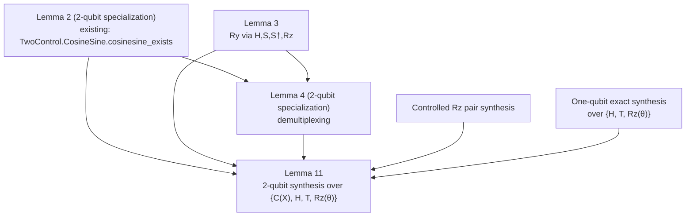

# Clifford Lemma 11 — Dependency Graph

This file records the proof graph that should be considered settled before the Lean stubs are written.

## Reading Notes

- `Lemma 2 (2-qubit specialization)` is imported from the existing cosine-sine appendix rather than reproved.
- `Lemma 4 (2-qubit specialization)` is the first genuinely new decomposition node in this track.
- `Controlled Rz pair synthesis` and `One-qubit exact synthesis` are local support propositions introduced because they are required by the planned proof of Lemma 11 even though they are not numbered Clifford-paper lemmas.
- The recursive `n`-qubit Lemma 1 is intentionally outside this first dependency graph.